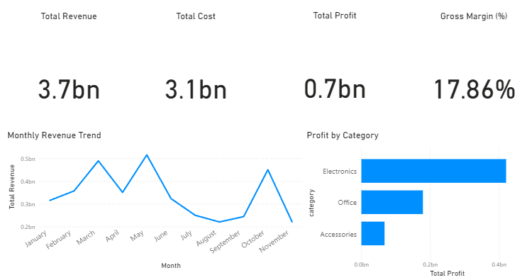

# Sales Performance Analysis Dashboard

## Overview
This project focuses on analyzing sales transaction data to identify revenue trends, profitability drivers, and product performance. The analysis aims to provide actionable business insights that can support data-driven decision-making.

## Dataset
- Transaction-level sales data (CSV format)
- Key columns: order_date, product, category, quantity, revenue, cost
- Data is structured to simulate real-world business transactions

## Tools & Technologies
- Python (Pandas, Matplotlib)
- Jupyter Notebook
- Power BI (for dashboard visualization)

## Analysis Workflow
1. Data loading and inspection  
2. Data cleaning and type conversion  
3. Feature engineering (profit, monthly aggregation)  
4. Exploratory Data Analysis (EDA)  
5. Business insight generation  

## Key Findings
- Revenue shows fluctuating trends with several peak periods throughout the year.
- The Electronics category generates the highest revenue but has lower profit margins.
- Accessories products tend to produce healthier profit margins.
- Cost control presents an opportunity to significantly improve overall profitability.

## Repository Structure

## Dashboard Preview

Below is a snapshot of the Power BI dashboard built to visualize sales performance and profitability.

### Insights Highlight
- Revenue shows fluctuating trends across months with noticeable peak periods.
- Electronics category contributes the highest profit compared to other categories.
- Despite high revenue, cost control plays a significant role in improving overall profit margin.

